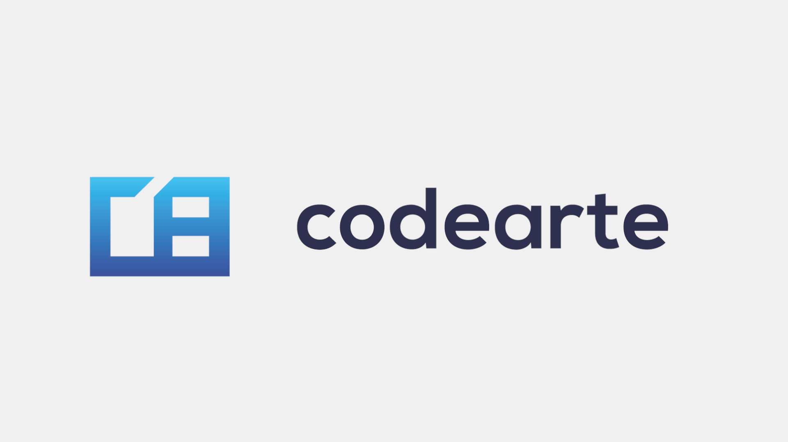

  

---

# Lautaro Bravo

**Senior Unity Engineer** with 7+ years of experience developing and shipping games for PC, mobile, and VR.  
Focused on **gameplay programming**, **AI systems**, and **tools development** with clean architecture and performance in mind.

I’ve worked on titles published on **Steam**, **App Store**, and **Google Play**, and led teams in both **indie** and **AA** environments.

---

### Areas of Expertise
Unity • C# • Gameplay Systems • Tools • AI • Optimization • Clean Architecture  
Spring Boot • FastAPI • Docker • Kafka • Microservices

---

### Featured Work
- [GOAP AI (Unity)](https://github.com/TaaroBravo/goap-ai) – Goal-Oriented Action Planning system for autonomous agents.  
- [Weapon Strategy System](https://github.com/TaaroBravo/unity-weapon-strategy-system) – Modular weapon system using Strategy Pattern.  
- [Semantic Audio Search](https://github.com/TaaroBravo/semantic-audio-search) – Self-hosted AI search for sound libraries.  
- [LocalizePro](https://assetstore.unity.com/packages/tools/localization/localizepro-308854) – Professional localization tool published on the Unity Asset Store.

---

### Also Find Me On
- Portfolio: [lautarobravo.com](https://lautarobravo.com)  
- Itch.io: [taarobravo.itch.io](https://taarobravo.itch.io)  
- Udemy: [Lautaro Bravo](https://www.udemy.com/user/lautaro-bravo)  
- Amazon Author: [Books](https://www.amazon.com/s?k=lautaro+bravo+de+la+serna)

---

  © 2025 Lautaro Bravo — Senior Unity Engineer & Technical Author

